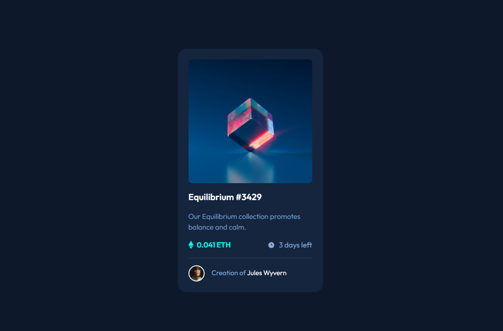

# Welcome! 👋

**"Thanks for checking out this front-end coding challenge."**

# Frontend Mentor - NFT preview card component

- Implemented with pure HTML & Css.

## Table of contents

- [Overview](#overview)
  - [The challenge](#the-challenge)
  - [Screenshot](#screenshot)
  - [Links](#links)
- [My process](#my-process)
  - [Built with](#built-with)
  - [What I learned](#what-i-learned)
  - [Continued development](#continued-development)
  - [Useful resources](#useful-resources)
- [Author](#author)
- [Acknowledgments](#acknowledgments)

## Overview

### The challenge

The challenge is to build out this product preview card component and get it looking as close to the design as possible.

### Screenshot

### Links

- Solution URL: [Click to check my solution at Frontend Mentor](https://www.frontendmentor.io/solutions/i-put-a-subtle-transitions-on-hover-J-8MS44V8V)
- Live Site URL: [Click to check the live site](https://cgm-thanhtike.github.io/NFT-preview-card-component/)

## My process

- First I analyze the deisgn
- Thinking the easiest way for layout like using flex box and grid
- I made css variables for color and font sizes etc..
- I made custom properties for color and background etc..

### Built with

- Semantic HTML5 markup
- CSS custom properties
- Flexbox
- CSS Grid

### What I learned

I have learnt about using pseudo element for background hover effect. And how to make smooth transition effects on hover.

## Author

- Website - [My git-hub profile](https://github.com/CGM-ThanHtike)
- Frontend Mentor - [My Frontend Mentor profile](https://www.frontendmentor.io/profile/CGM-ThanHtike)

**Thank you all!** 🚀